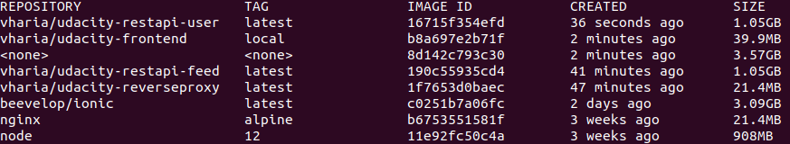
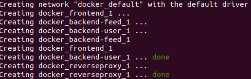
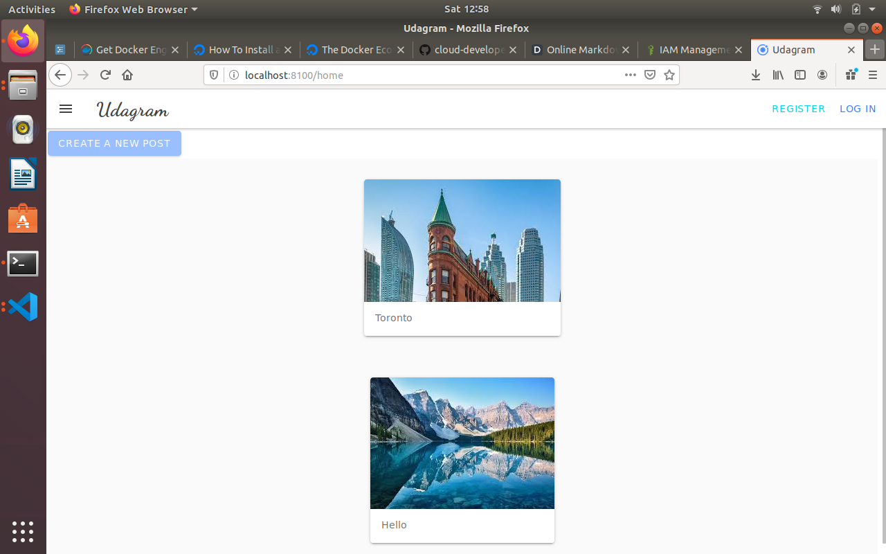

This is an attempt to create microservices of the Udagram application(an instagram clone) and run the services on Docker containers locally and on Kubernetes cluster on AWS.

For simplicity, we are using this single repo here for all the services.

There are total 4 microservices in the system - 
1. Backend user : /course-03/exercises/udacity-c3-restapi-user/
2. Backend feed : /course-03/exercises/udacity-c3-restapi-feed/
3. Nginx : /course-03/exercises/deployment/docker/DockerFile
4. Frontend : /course-03/exercises/udacity-c3-frontend/

## Running the services locally on Docker containers
### Prerequisites
- Docker compose
- Environment variables
  - To create and run the application locally using Docker containers, following **_environment variables_** needs to be configured first:
    - POSTGRESS_USERNAME
    - POSTGRESS_PASSWORD
    - POSTGRESS_DB
    - POSTGRESS_HOST
    - AWS_REGION
    - AWS_PROFILE
    - AWS_BUCKET
    - JWT_SECRET
    
### Docker Images
 - All the services have their respective Docker files.
 - Docker compose file is located at - __course-03/exercises/deployment/docker__ in the repository.
	
 - Use the below docker-compose command to build all the Docker Images
```
sudo docker-compose -f {path to the docker-compose-build.yaml}/docker-compose-build.yaml build
```
- Once all the images are built successfully, run the below docker command to verify the images
```
sudo docker images
```

You should see something similar like below picture


### Starting the app as containers on a local system
- After all the images are built locally using the `docker-compose build` command, use the below `docker-compose` command to run the application containers locally.
```
sudo docker-compose up		
```	
- `docker-compose up` command will create container for each of the 4 services, and you should see similar to the below picture in your terminal.



- After that, navigate to - `localhost:8100`

***
***
## Setup and Running application on AWS 
There are 2 parts of this:  
### 1. Setting up the Kubernetes cluster:
- One of the simplest way to setup the cluster on AWS is using Kubeone and Terraform.
  - steps are here - https://github.com/kubermatic/kubeone/blob/master/docs/quickstart-aws.md
		
### 2. Deploying and running the application on the cluster:
- Once the Kubernetes cluster is running on AWS, follow below steps to deploy the application services on the cluster.
- Before starting, make sure your local `kubectl` is able to connect to your cluster. Run `kubectl version` command and you should see the server component as well in the output.

- The kubernetes config files are located at - __/course-03/exercises/deployment/k8s/__ in the repository.
- First create the configMaps and secrets required for the application.
    - Create **_configmaps_** and **_secrets_** for your application
      - update the values first in `env-configmap.yaml` file and then apply the config map by cmd - `kubectl apply -f env-configmap.yaml`
      - Similarly, updates the values first in both the secrets (base64 encoded) in `env-secret.yaml` and `aws-secret.yaml` files and then apply the secrets by using the `apply` cmd - `kubectl apply -f {fileName}`
    - Next, start creating the `deployment` and `service` objects for each of our service.
      - backend-user
        - deployment : `kubectl apply -f    	backend-user-deployment.yaml`
        - **please note: all the deployments uses the image that we created above. If you have changed the image name above, then change the image name in all the deployments.yaml file as well**
        - service : `kubectl apply -f backend-user-service.yaml`
      - backend-feed
        - deployment : `kubectl apply -f    	backend-feed-deployment.yaml`
        - service : `kubectl apply -f backend-feed-service.yaml` 
      - frontend
        - deployment : `kubectl apply -f frontend-deployment.yaml`
        - service : `kubectl apply -f frontend-service.yaml` 
      - Nginx reverseproxy
        - deployment : `kubectl apply -f reverseproxy-deployment.yaml`
        - service : `kubectl apply -f reverseproxy-service.yaml`

#### Testing the application
- One of the easy way to test the application is by **_port forwarding._**
- Forward the local ports `8080` to `reverseproxy-service` and `8100` to `frontend-service`, respectively.
```
kubectl port-forward service/reverseproxy 8080:8080
```
```
kubectl port-forward service/frontend 8100:8100
```
- and then, visit - `localhost:8100` in your browser.
